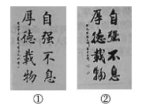

​         **九年级上册**

**文言文**

\1.   岳阳楼记

\2.   醉翁亭记

\3.   湖心亭看雪

**综合性学习**

\1.   君子自强不息

\2.   走进小说天地

 

​        **综合性学习：君子自强不息**

​             谢汉亮 

你所在的学校正在举办以“君子自强不息”为主题的综合性学习活动。请你积极参加并完成以下任务。

**（****1****）下面是同学们搜集到的两幅书法作品****,****请指出它们各属于什么字体****,****并结合字体特征说说你喜欢哪一幅及理由。**

​          

【示例】①楷书:因为字体端庄,匀称工整②行书(行楷),因为笔画连绵,灵活连贯

 

**（2）****中国古典诗词中有很多表达“自强不息”含义的名句****,****请你举出一例并说说其含义。**

【示例】“老骥伏枥,志在千里;烈士暮年,壮心不已”。这句诗蕴含着一股自强不息的豪迈气概,深刻地表达了诗人老当益壮、锐意进取的精神。抒发了诗人不甘年迈,生命不息,奋斗不止的壮志豪情

**（3）****你所在的班级正在开展以“君子自强不息”为主题的综合性实践活动****,****有一些问题需要完成。**

**①自强不息的精神其实与我们的生活是紧密结合的小康很热爱篮球运动****,****但是他几次报名学校篮球队都因身材过于瘦小被拒绝。小康很苦恼****,****想要放弃****,****但尝试过其他运动以后****,****还是最喜爱篮球。他的同学们也分成两派****,****一些同学劝他改学其他运动****,****以后长高了再加入校篮球队****;****一些同学鼓励他坚持自己的爱好****,****多加练习****,****请围绕这个话题****,****写出你的观点、理由及结论****,****字数在****80****字以内****,****【微写作】**

【示例】我认为小康应该坚持自己的爱好。乒坛“国手邓亚萍小时候也因身材矮小被球队拒绝过,但是她却能自强不息,刻苦训练,最后享名国内外所以小康应该坚持爱好,努力练习。

**②我国有许多鼓励人们自强不息的对联。下面的对联就颂扬了这种精神****,****请你根据上联****,****补写出下联。**

**上联****:****一路风雨兼程磨意志**

**下联****:**

【示例】半载苦乐同享铸就辉煌

**（****4****）你校正在开展以“青春·奋进”为主题的综合性实践活动****,****请你积极参与并完成以下任务。**

**请你拟写一条简洁优美的主题宣传语。**

【示例】①青春的魅力;②珍惜青春,笑看生活;③放飞青春,放飞梦想④青春在拼搏中闪光

 

 

**综合性学习：走进小说天地**

​      詹高瞻

目标：1.激发阅读兴趣，拓展阅读视野，陶冶高尚情操。

2.能复述小说情节，介绍小说人物，叙述自己的读书经历，描述读书感受尽量做到生动有趣，引人入胜

\3. 发挥想象力和创造力，学习虚构故事，尝试进行小说创作。

 

重要小说作品内容介绍：

1、《儒林外史》是清代吴敬梓创作的长篇讽刺小说，全书五十六回，以写实主义描绘各类人士对于“功名富贵”的不同表现，一方面真实的揭示人性被腐蚀的过程和原因，从而对当时吏治的腐败、科举的弊端礼教的虚伪等进行了深刻的批判和嘲讽；一方面热情地歌颂了少数人物以坚持自我的方式所作的对于人性的守护，从而寄寓了作者的理想。

2.《红楼梦》，中国古典四大名著之首，清代作家曹雪芹创作的章回体长篇小说，又名《石头记》《金玉缘》小说以贾、史、王、薛四大家族的兴衰为背景，以贾府的家庭琐事、闺阁闲情为脉络，以贾宝玉、林黛玉、薛宝钗的爱情婚姻故事为主线，刻画了以贾宝玉和金陵十二钗为中心的正邪两赋有情人的人性美和悲剧美。通过家族悲剧、女儿悲剧及主人公的人生悲剧，揭示出封建末世的危机。

3.《三国演义》描写了从东汉末年到西晋初年之间近百年的历史风云，以描写战争为主，诉说了东汉末年的群雄割据混战和魏、蜀、吴三国之间的政治和军事斗争，最终司马炎一统三国，建立晋朝的故事。反映了三国时代各类社会斗争与矛盾的转化，并概括了这一时代的历史巨变，塑造了一群叱咤风云的三国英雄人物。

4.《水浒传》是元末明初[施耐庵](https://baike.baidu.com/item/施耐庵/169936)（现存刊本署名大多有施耐庵、[罗贯中](https://baike.baidu.com/item/罗贯中/172206)两人中的一人，或两人皆有）编著的[章回体](https://baike.baidu.com/item/章回体/11018000)长篇小说。全书通过描写[梁山好汉](https://baike.baidu.com/item/梁山好汉/83742)反抗欺压、水泊梁山壮大和受宋朝招安，以及受招安后为宋朝征战，最终消亡的宏大故事，艺术地反映了中国历史上宋江起义从发生、发展直至失败的全过程，深刻揭示了起义的社会根源，满腔热情地歌颂了起义英雄的反抗斗争和他们的社会理想，也具体揭示了起义失败的内在历史原因。《水浒传》是中国古典四大名著之一，问世后，在社会上产生了巨大的影响，成了后世中国小说创作的典范。《水浒传》是中国历史上最早用白话文写成的章回小说之一，流传极广，脍炙人口；同时也是汉语言文学中具备史诗特征的作品之一，对中国乃至东亚的叙事文学都有深远的影响。

 

真题在线：

1.（江苏南京中考）班级要出一期“小说天地”的板报，你和小伙伴们需完成以下几件事。

（1）文文编辑“小说悦读”栏目，你想在她的阅读感言中加一句话，最合适的是（　　）

  翻开语文书，走进小说天地，我见到了一个个鲜明的少年形象：有月夜沙地守护瓜田的小闰土，       ，还有课余林中朗读《万卡》的李京京……他们给我留下了深刻的印象，让我久久不忘。

A.   有夜晚苇塘护送女孩的杜小康 

B.   有杜小康夜晚苇塘护送的女孩

C.   有夜晚芦荡寻找鸭群的杜小康 

D.  有杜小康夜晚芦荡寻找的鸭群

【解析】由横线前后句子可知，句式结构为：“有……（时间、地点）……（动宾短语）的……（人物名）”，故排除选项B、D；选项中的人物事件均围绕《孤独之旅》展开，联系课文内容可知，选项 A中情节未被提及，故排除；杜小康与鸭群联系密切，故选C。

（2）关关编辑“小说延读”栏目，展开想象，续写了《最后一课》，请你补充其中的一段对话。

  我（小弗郎士）的最后一堂法语课结束了，大家陆续地离开了教室。韩麦尔先生依然待在那儿，头靠着墙壁，话也不说。我走到他面前。

我说：①_______________________________________

他说：②_______________________________________

我说：③_______________________________________

他说：④_______________________________________

答案示例：

1.韩麦尔先生，您别难过，我会永远记住今天的课的。”

2.“谢谢你，好孩子，你更要记住我们的法语啊！”

3.“您放心，韩麦尔先生，我会继续好好学习法语的。”

4.“对，只要我们心里装着法语，我们的法国就不会灭亡。”

 

\2. （湖南长沙中考）综合运用。

　　某班拟开展“走进文学部落”系列活动，请你参加并完成下列任务。

（1）班上准备创办一份班刊，请你给班刊取一个富有文学韵味的刊名。班刊名：《         》

答案示例：诗意长廊、含英咀华等

（2）班级文学社开展“重新设计作品人物命运”的活动，请你仿照例句的形式，重新设计孔乙己的命运。

例句：假如范进没能考中举人，他最终的命运只能是穷愁潦倒，饥饿而死。

仿写：假如孔乙己考中举人，他               。

答案示例：最终的命运只能是功成名就却贪婪而终。

（3）班级文学社要选取一副对联悬挂在其阅览室，最合适的一项是（  ）

A.宾至如归，少安毋躁

B.四面荷花三面柳，一城山色半城湖

C.室雅何须大，书香不在多

D.藏古今学术，聚天地精华

【答案解析】C,由“室雅”和“书香”可知，符合“走进文学部落”主题的要求，适合阅览室的文化氛围。

四、模拟演练  

1.小说以其鲜活的人物、跌宕的情节吸引着千千万万的读者。为此，班级组织了“走进小说天地”综合性学习活动，请你完成下列任务。

（1）活动中，同学们搜集了自己喜欢的小说人物的相关资料，做了一个小集子。请你为小集子取一个名字。

示例：小说人物集锦（荟萃）

（2）你所在的小组要调查同学们课外阅读小说的情况。假如你是调查小组的组长，请你确定两个调查主题

示例：①课外阅读小说的时间有多少；②小说阅读书目有哪些；③阅读小说的方法；④就课外阅读小说给老师和学校的建议。（任答2点即可）

（3）在阅读小说的过程中，你一定总结了许多有效的方法，请简要介绍。（写出两点即可）

示例：①读人物、读情节、读环境； ②边读边联想；③边读边做读书笔记。（写出两点即可）

（4）你一定读过不少小说，请举一部你最喜欢的，并写明喜欢的理由。示例：《水浒传》。因为《水浒传》塑造了一批栩栩如生的人物形象，且故事情节曲折、生动，很吸引人。

 

 

 

 

 

​    **九年级上册古诗****+****文言文课后习题及答案**

​                      第八组 刘家慧

**文言文：《岳阳楼记》《醉翁亭记》《湖心亭看雪》**

**课内古诗：行路难（其一）** **酬乐天扬州初逢席上见赠** **水调歌头**

**岳阳楼记**

**一、北宋诗人陈师道曾经指出****:“****范文正公为《岳阳楼记》****,****用对语说时景****,****世以为**

**奇这篇散文融入了赋的特点****,****大量运用排比、对偶等修辞手法****,****富有文采和诗意****,**

**读来朗朗上口****,****铿锵有力。有感情地朗读课文****,****体会其中的语言美****,****并在熟读的基**

**础上加以背诵。**

参考答案:

【示例】这篇文章的语言富有特色,极具美感。它虽然是一篇散文,却穿插了许多四

言的对偶句,如“日星隐曜,皓月千里,浮光跃金,静影沉璧等,这些骈句为文章增

添了色彩。同时,这些四言句有的又形成排比句,如阴风怒号,浊浪排空,日星隐

曜,山岳潜形,商旅不行等,这些排比句句式整齐,富有气势。可抓住这些特点熟

读课文并加以背诵。

**二、朗读课文第****3.4****段，结合具体语句谈一谈它们各自描写了什么样的景象，其中蕴含着作者怎样的心境。**

参考答案：这两段是拟写迁客骚人的览物之情”。第3段以转接连词若夫开始,含有假定意味,格调低沉。这一段描绘了一幅洞庭风雨图:“淫雨罪罪”,写阴雨连绵不断;“阴风

怒号,浊浪排空,写风大浪高,令人生畏;“日星隐曜,山岳潜形,写阴雨天的晦暗;“檣倾楫摧”,写舟船覆灭的景象;“薄暮冥冥,虎啸猿啼”,写环境的阴森恐怖。第4段以转接连词至若开启,虽然也含假设意味,但格调转高。这一段描绘了一幅洞庭春晴图":“春和景明,波澜不惊”,写春风和煦,日光明亮,水面平静;“上下天光,一碧万顷,写水天一色,浩瀚无边;“沙鸥翔集,锦鳞游泳,写飞鸟与游鱼的欢快;“岸芷汀兰,郁郁青青”,写草木的繁茂;“长烟一空,皓月千里,写湖上烟雾消散、明月朗照;“浮光跃金,静影沉璧”,写月映湖水,金色玉光;“渔歌互答,写渔人之乐。这两段景物描写,是作者在真实生活基础上的虚拟体验,具有高度概括性。作者的心境,呼应着景物,与游人共悲欢。第3段,表现出远谪的悲苦、郁闷之

情;第4段,表现出心旷神怡、遗忘得失宠辱的乐观情怀。

**三、这篇课文中的记事、写景、抒情和议论之间是怎样的关系****?****结合具体语段****,****加以分析。**

参考答案:

从全文看,本文写景、抒情、议论是融为一体的;具体而论,又表现出鲜明的层性,表现出写景的独立,和议论与抒情的融合。如第2段概写洞庭景物后,以“然，则”一转,接以提问式的议论;第3段写洞庭风雨,第4段写洞庭春晴,后面都接以抒情;第4段则以“嗟夫!开头,表现出强烈的抒情色彩,然后又接以整段的议论,议论中含有抒情的色彩。文章最后又归于单纯而强烈的抒情,即“噫!微斯人,吾谁与归?“这样,写景与议论、抒情相互映衬,完美的表达了作者的思想情感。

**四、****“****古仁人与迁客骚人有什么不同****?“****先天下之优而优****,****后天下之乐而乐体现了作者怎样的政治理想****?**

参考答案:

“迁客骚人的观物之情是阴风苦雨则悲,风和日丽则喜。“古仁人则不然,他们“不以物喜,不以己悲,无论是在朝还是在野,忧民忧君之心不改,具有先忧后乐的伟大襟怀。“先天下之忧而忧,后天下之乐而乐是作者假托古仁人的政治理念,含蓄地表达了自己的政治理想:以治国安邦为己任,忧在天下人之前,乐在天下人之后。这种先忧后乐的思想,是对儒家传统的与民同乐观念的发展,更具有居安思危的忧患意识和舍己为人的奉献精神。

**五、解释下列加点的词语。**

1.***属\***于作文以记之

2前人之述***备\***矣

3.然则北通巫峡,南***极\***潇湘

4.***薄暮\***冥冥,虎啸猿啼

5去***国\***怀乡,忧谗畏讥

参考答案:

\1.   同嘱”,嘱托。2.详尽3至、到达4.迫近5国都。

**六、岳阳楼是江南名楼****,****古往今来****,****无数文人登临揽胜****,****留下了许多名篇佳作。如李白《与夏十二登岳阳楼》、杜甫《登岳阳楼》、陈与义《登岳阳楼》等。找来这些诗读一读****,****体会其中的思想感情。**

点拨:

借助图书馆、网络等工具搜集这些佳作,联系其写作背景,探究作者的思想情感,体会所抒情感的不同。

参考答案:

李白《与夏十二登岳阳楼》:楼观岳阳尽,川迥洞庭开。雁引愁心去,山衔好月来。云间连下榻,天上接行杯。醉后凉风起,吹人舞袖回。思想感情:诗人通过对秋风明月下的浩荡无边的洞庭夜景的描写,表达了诗人流放途中遇赦的喜悦心情。

 

**醉翁亭记**

**一、朗读并背诵课文****,****说说第****1****段如何由远及近、一步步****“****推出****”****醉翁亭的****,****体会这样的描写效果。**

设计意图:引导学生在朗读、背诵的基础上,体会本文开头景物描写由大到小、层层递进的写法,感受作者叙述语言的表现力。

参考答案:文章第1段以“环滁皆山也”总起,仿佛是一个航拍的全景镜头。然后再逐层拉近,渐次推出“西南诸峰”、琅琊山、山行之路、酿泉之水,最后定格在“翼然临于泉上”的醉翁亭。这样如层层剥笋,最后亮出主景,既准确交代了醉翁亭的地理位置,又给人以移步换景、身临其境、目一新的感觉。

**二、课文****2****、****3****、****4****段开头的****“****若夫****”“****至于****”“****已而****”****等词语有什么作用****?****这三段是按照怎样的顺序来写的****?**

设计意图:引导学生注意本文一些表示转接的词语的用法,体会文章段落之间的逻辑顺序。

参考答案:课文2、3、4段开头,分别用了“若夫”“至于”“已而”等表示转接的词语,起到了标记语意转变的作用。“若夫”是表示转接的连词,含有假设和例说的意思。“至于”同样表示转接,却含有进层的意思表示描写的进一步深入。“已而”是表示时间的副词,是时间短暂的诗意表述,表示时间的推移、暗示场景的转换。第2段写山中朝暮、四时景物变化之美,第3段写滁人游、太守宴,第4段写游归,主要探讨了几种乐的境界。点明太守是谁,收束全文。这算三段是按照写景写人写“乐”的顺序写的,脉络清晰,层次分明。

**三、本文多处提到了****“****乐****”,****主要表现表现了哪几种****“****乐****”?“****醉能同其乐****,****醒能述以文****”,****表达了**

**作者怎样的志趣****?**

设计意图:引导学生注意本文扣着“乐”字叙事、议论的特点,进而体会作者“与民同乐”及援笔为文的丰富感情。

参考答案:本文中共出现了10个“乐”字,其中有7个集中在最后一段。归结起来,这些

“乐”有:1.山水之乐;2.宴饮之乐;3.禽鸟之乐;4滁人之乐;5.太守之乐。“醉能同其乐,醒能述以文者”,表达了作者“与民同乐”、以文记乐的情趣,流露出为政一方、造福一方的自信、得意,以及捉笔成文的自负。

**四、本文用了****21****个****“****也****”****字****,****有的表示判断****,****有的表示陈述。朗读下列语句****,****结合上下文体****“****也****”****字表达的语气。**

1.环滁皆山也。

2.望之蔚然而深秀者,琅琊也

3.作亭者谁?山之僧智仙也。

4.名之者谁?太守自谓也。

5.醉翁之意不在酒,在乎山水之间也

6.山水之乐,得之心而寓之酒也。

设计意图:引导学生注意文中“也”字的用法,体会作者“也字体”叙述语言的独特和精妙。

参考答案:第1、2、3、4句表示判断,语气更为肯定;第5、6句表示陈述,语气较为和缓。

**五、《岳阳楼记》和《醉翁亭记》中有一些短语已经变成了成语****,****在后世流传****,****找出来****,****说说它们在文中的含义及在现代汉语中语义的变化。**

设计意图:引导学生找出两篇课文中的成语,

并分析他们在现代汉语中的应用情况。

参考答案:《岳阳楼记》中的成语:

政通人和:政事顺利,百姓和乐。(在现代汉语中的意思没有变化)

百废俱兴:各种被废置的或该办未办的事业都兴办起来。(在现代汉语中,“具”写作“俱”,也说“百废俱兴”)

浩浩汤汤:水势浩大的样子。(在现代汉语中多写作:“浩浩荡荡”)

气象万千:形容景色多种多样,非常壮观。(在现代汉语中也用以形容事物多样、壮观)

心旷神怡:心情舒畅,精神愉快。在现代汉语中的意思没有变化)

《醉翁亭记》中的成语:

峰回路转:形容山峰、道路迂回曲折。(在现代汉语中,也比喻经过挫折后出现转机)

醉翁之意不在酒:醉翁的意趣不在酒上面。(在现代汉语中多用来表示本意不在此而在别的方面)

水落而石出:水落下去,石头就露出来。(在现代汉语中多用来比喻真相大白,简写为“水落石出”)

觥筹交错:酒杯和酒筹交互错杂。(现代汉语中也用以形容许多人饮酒的热闹场面,意思没有变化)

 

**湖心亭看雪**

**一、朗读并背诵课文。课文是人哪几个角度写西湖雪景的****?****文中有关湖上影子的几句描写有什么特点****?**

参考答案:

三个角度:(1)未写西湖时,概概写:“大雪三日,湖中人鸟声俱绝。”(2)(游西湖时)先总写:“天与云与山与水,上下一白。(3)(游西湖时)后具体描写:“湖上影子,惟长堤一痕、湖心亭一点,与余舟一芥、舟中人两三粒而已。文中有关湖上影子的几句文字,运用白描的手法,由远及近,写出了“湖上雪后最具代表性的景物,即长堤、湖心亭、舟、舟中人。这些景物与

人,在大雪的笼罩下全都变得虚无縹缈、模糊微小,变成了一痕、一点、一芥、两三粒,具有了童话般的梦幻色彩。然而最微不足道的“两三粒人却是这空旷寂寥的雪世界的主人,他们是赏雪的主体。作者的描写,宛如中国画的写意手法,寥寥几笔,就传达出景物的形与神。

**二、****“****湖中焉得更有此人一语****,****与文中哪句话相互映衬****?****试结合语境****,****分析这两句话**

**的表达效果。**

参考答案:

“湖中焉得更有此人一语,与结尾舟子的喃喃自语莫说相公痴,更有痴似相公者相相互映衬。前者借客偶遇知音的惊喜,赞美作者之痴”,后者借舟子之口,说“客之“痴”,为作者之“痴找到“同僚”,找到了可以原谅的“理由。作者超凡脱俗的行为和孤高自赏的情怀,不但在“客那里引起了共鸣,也与“客和鸣”,仿佛让本无雅趣的舟子受到了“痴的精神的感染。

**三、阅读下面三副有关湖心亭的对联****,****说说你的理解。**

四季笙歌,尚有穷民悲夜月;

六桥花柳,浑无隙地种桑麻。

-［明］胡来朝

亭立湖心,伊西子载扁舟,雅称雨奇晴好;

席开水面,恍东坡游赤壁,偏宜月白风清。

-［明］郑焊

如月当空,偶以微云点河汉;

在人为目,且将秋水剪瞳神。

-［明］张岱

点拨:

理解这三副对联的字面意思,然后结合作者身份或写作背景进行探究。

 

 

**诗词三首**

**一、《行路难》****(****其一****)****以浪漫的笔法抒写了作者的人生感慨和精神追求。对此****,****你是怎么理解的****?**

设计意图:引导学生理解本诗浪漫的笔法以及作者的人生感悟和追求。

参考答案:浪漫的笔法主要表现在词语、诗句、意境的夸张上。词语的夸张,如“金樽”“玉盘”“斗十千”“值万钱”;诗句的夸张,如“拔剑四顾心茫然”“长风破浪会有时,直挂云帆济沧海”;意境的夸张,如“欲渡黄河冰塞川,将登太行雪满山”,“闲来垂钓碧溪上,忽复乘舟梦日边”。诗句和意境的夸张,往往还伴随着浪漫而奇特的想象,用浪漫的笔法写人生追求,一方面表现了作者人生追求的不同寻常,另一方面也说明这些追求可能不切实际。

**二、《酬乐天扬州初逢席上见赠》的作者被贬官在外多年****,****回京路上怀想往事****,****展望将来****,****心绪难平中又不乏刚健昂扬之气。这种复杂的情绪是通过哪些意象表现出来的****?****结合具体诗句加以分析。**

设计意图:引导学生关注本诗丰富的意象,及其对诗人情绪表达的作用。

参考答案:凄凉的巴山楚水、“闻笛赋”和“烂柯人”,“沉舟”和“病树”这些意象表现了作者以平静的心绪;而“千帆过”“万木春”等意象又表现出诗人刚健昂扬的精神。诗人选取意象,无论是悲还是喜,无论是扬还是抑,“皆着我之色彩”,历历分明。

**三、《水调歌头》这首词句句扣住****“****月****”****来写****,****情感多次起伏变化****,****在抑扬之间反复转换****,****有很强的感染力。有感情地朗读****,****结合具体词句****,****梳理作者情感的变化轨迹****,****说说其中表达了他对人生怎样的思考。**

设计意图:引导学生注意这首词处处写月又时时写情的特点,把握词人的情感走向,理解他对人生的思考。

参考答案:词以问月开篇情感高亢激昂,具有诗性宇宙的意识;接下来写“我欲乘风归去,又恐琼楼玉宇,高处不胜寒”,想象丰富,情感浪漫而又有近乎幽默的别趣;“起舞弄清影,何似在人间”,抒情热烈,情感也转为通达、豪放;下片开头写月光的流转,引出第二次问月,情感幽深绵长;“人有悲欢离合,月有阴晴圆缺,此事古难全”,转而为议论,情感变为通透、豁达。最后一句“但愿人长久,千里共婵娟”,仰天长叹,代替世人发出美好的祝愿,感情热烈而奔放。词人由对明月的发问,到对仙境的向往,又归回对人间的留恋。继而将人世的“悲欢离合”与月的“阴晴圆缺”做对比照,发出了“此事古难全”的感慨。他悟出人世不可避免地有“悲欢离合”的人生哲理,那么,美好的祝愿就不能太“贪”。“但愿人长久”,虽然不能团聚,也能“千里共婵娟”:这也许是最明智,也是最无奈的选择吧!

**四、有感情的反复朗读课文****,****在熟读的基础上背诵这三首诗词。**

设计意图:引导学生把握这三首诗词的感情基调和情绪变化,在此基础上熟读成诵。

参考答案:略

**五、这三首诗词都体现了诗人不如意时的豁达胸怀。请以其中一首为例****,****谈谈你从中得到的人生启示。**

设计意图:引导学生体会诗人遭遇人生挫折时表现出的豁达胸怀,并谈谈从中受到的启发。

参考答案：

示例：李白在人生道路充满艰难险阻之时，不是一味地悲愤、苦闷，他发出了“长风破浪会有时，直挂云帆济沧海”的最强音。我们从中懂得，人生之路不会永远都一帆风顺，遇到困难挫折的时候，应不畏缩，要有乐观向上、积极进取的人生态度，坚持不懈地追求自己的理想。

 

 

 