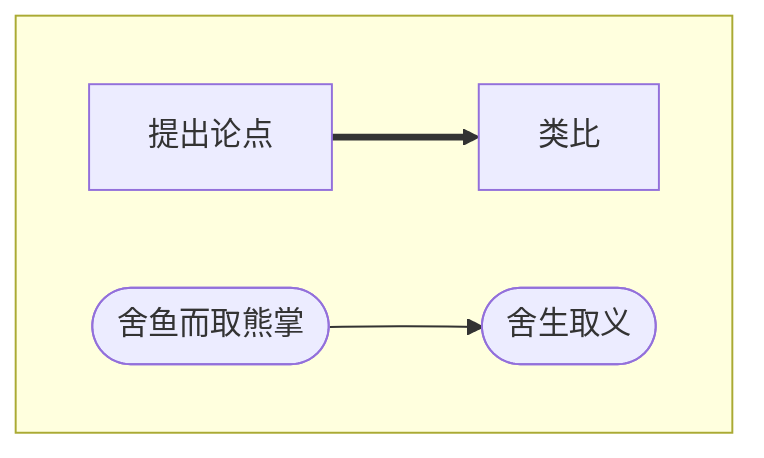
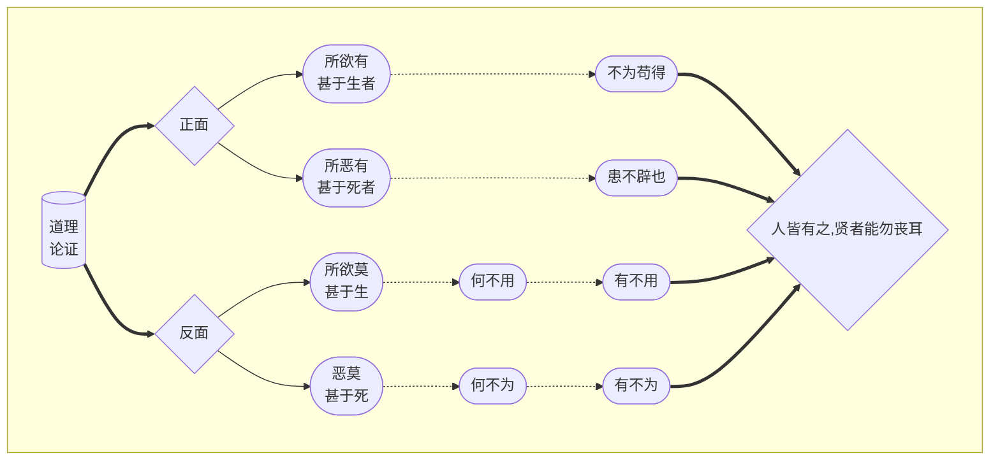
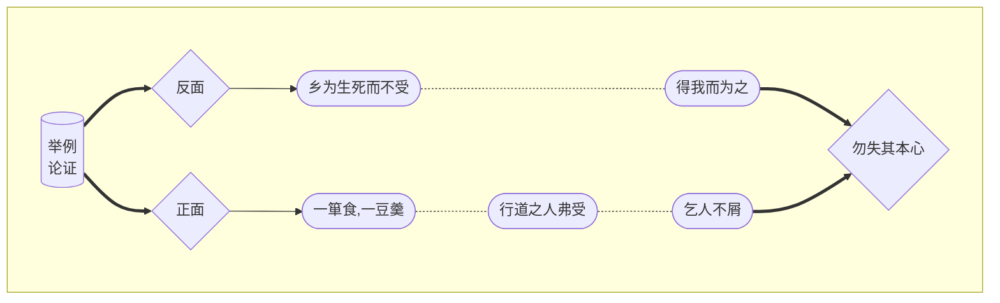

> 整理人：圳杰、黄可欣
>
> 图表使用[**mermaid**](https://mermaid-js.github.io/mermaid/#/)制作

## 问题一

**本文注重推理，逻辑严密。根据课文内容理解作者的论证思路，把下面的图表补充完整。**

### 参考答案：

------

## 问题二

**反复朗读并背诵课文。根据课文的具体内容，说说你对“本心”的理解。** 

### 参考答案：

本心是指与生俱来的良心、良知，表现为恻隐之心、羞恶之心、辞让（恭敬）之心、是非之心，其内核分别为仁、义、礼、智。在本文侧重指羞恶之心。孟子认为本心“人皆有之”，只是普通人容易丧失，“贤者能勿丧耳”。“本心”是孟子基于人性本善的观点提出来的重要概念，他认为人类的良知是一种本能的心理状态，不学而有，不教而在。所谓修身，就是要保有“本心”。

------

## 问题三

**辨析下列各组加点词的意义和用法。**

1. 所欲有甚<u>**于**</u>生者

   `介词，表示比较`

   万钟**于**我何加焉

   `介词，引出动作对象`

2. 则凡可以辟患者何不**<u>为</u>**也

   `做，为了`

   乡<u>**为**</u>身死而不受

   `给予，同`

------

## 问题四

**孟子善于运用日常生活中的事例进行类比说理,使抽象的道理变得浅显易懂。学习这种方法,写一段话,说明一个道理。**

### 参考答案：

“学然后知不足”,雄鹰只有在搏击蓝天时,才知道天空是多么辽阔,而自己又是多么渺小;小溪只有在奔入大海时,才知道海洋是多么宽广,而自己又是多么微不足道;同样个人只有当他学得愈多时,他才知道学海无涯;而自己学到的知识只不过是沧

