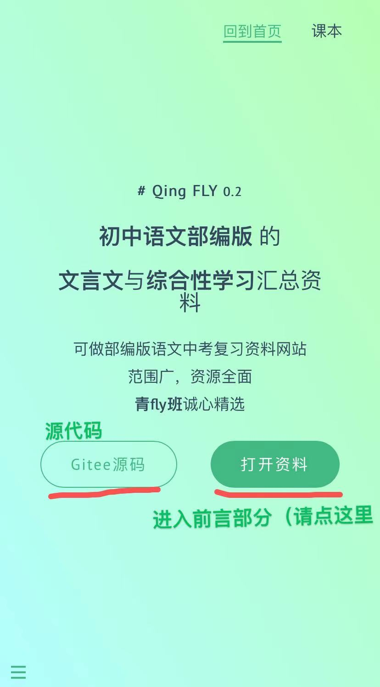
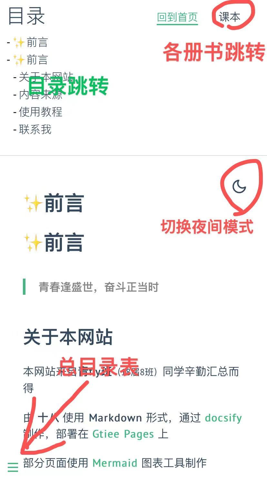
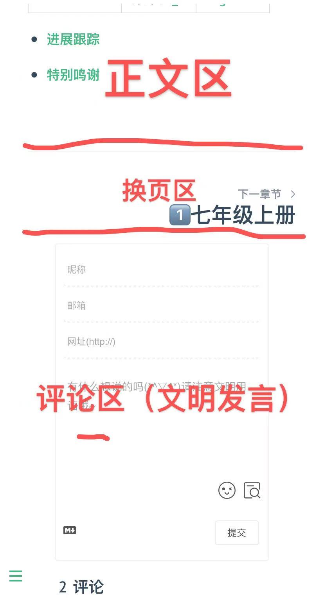
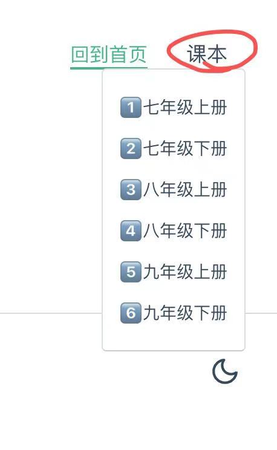
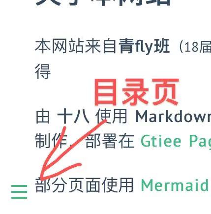
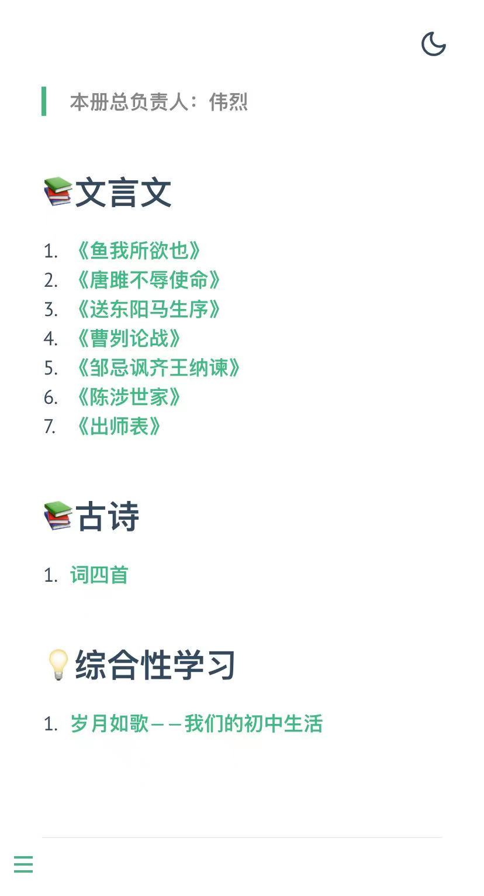

## 使用须知

- 本文档遵循[CC-BY-SA-4.0](https://gitee.com/eighteen18/qing-fly/blob/master/LICENSE)协议，具体内容文末请见
- 建议使用 **PC** 或 **iPad** 获得更好体验
- 如有疑问，可发在十八的QQ邮箱`（736458622@qq.com）`，或在Gitee提交issuse

## 页面

`封面`

`正文`

`底部`

------

## 浏览

1. 进入网站后，会出现文档封面，请点击[打开文档](README)进入前言

2. 点击右上角<u>**课本**</u>，即可选择所需要查看的对应课本

   `或`

   点击左下角三条杠，查看当前目录，也可以进入相应课本

3. 之后您会进入导航页，点击标题即可浏览

------

## 评论须知

评论区是提供给用户讨论交流的区域，每课都有独立的评论区。

您的每一次评论，都证明您同意将当前 **使用的设备** 与 **网络IP** 公开。

!>**您的任何不恰当言论都会受到相应的惩罚。**

!>**请务必文明用语。**

------

## 文档协议

### 适用范围

本许可证适用于自由文化作品，包括但不限于网站、图像、视频、博客、电子文档、书籍、数据集等。

### 您可以自由地：

**共享** — 通过任何媒介和任何形式复制、转载本作品。

**改编** — 在任意用途下合成、转换和改造本作品，甚至是商业性的。

只要您遵循许可证条款，版权方就不能收回您的这些权利。

### 依据下列条款：

**注明版权归属** — 您必须附上原始作品的来源及本许可证的链接，同时说明是否修改了原始作品。您可以用任何合理的方式来注明原始作品的版权归属，但是不得以任何方式表明版权方认可您或您的使用。

**相同方式共享** — 若您改编了原始作品，则您必须使用和原始作品相同的许可证来分发您的衍生作品。

**不得附加限制** — 您不得使用任何法律条款或技术措施，在法律上限制别人做许可证准许的任何事情。

### 声明：

当你使用本作品中属于公众领域的要素，或当法律有例外或限制条款允许您使用时，您无需遵从本许可证。

不提供担保。本许可证可能不会授予能满足您使用所必须的所有许可，诸如肖像权、隐私权、人格权等可能会限制您如何使用本作品。

?>上面这个只是“CC BY-SA 4.0”许可证的内容摘要，仅强调许可证的部分关键特点及条款，不具备法律效力，您应该仔细阅读[完整的许可证](https://creativecommons.org/licenses/by-sa/4.0/legalcode)的所有条款及条件。