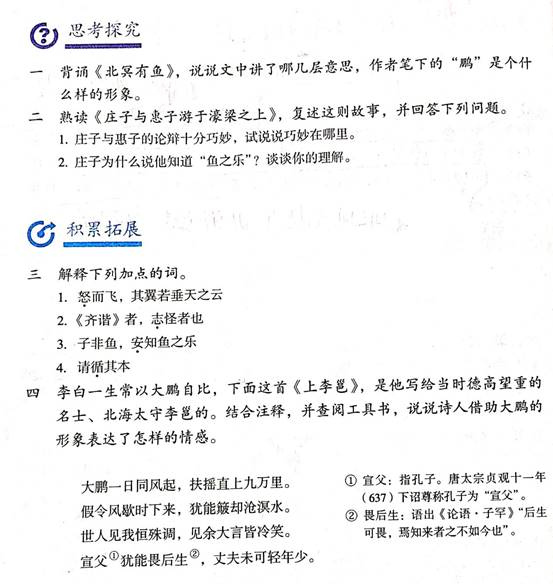

> 整理人：炜城、佳彤

## 原图

------

## 问题一

**背诵《北冥有鱼》，说说文中讲了哪几层意思，作者笔下的“鹏”是个什么样的形象。**

### 参考答案

1.《北冥有鱼》讲了三层意思：第一层是对鹏的基本介绍，突出鹏鸟出身不凡及体型庞大；第二层论述鹏鸟迁徙“有所待”；第三层论述鹏鸟的认识也是有局限的。作者通过这个故事，说明任何事物的存在都是依附于一定的条件的，它们的活动都是有所凭借的。鲲鹏形体硕大无比，变化神奇莫测，怒而飞时气势壮美。

------

## 问题二

**熟读《庄子与惠子游于濠梁之上》，复述这则故事，并回答下列问题。**

1. 庄子与惠子的论辩十分巧妙，试说说巧妙在哪里。
2. 庄子为什么说他知道“鱼之乐”？

### 参考答案

1.惠子善于抓住对方的漏洞之处，他巧妙地援引庄子的反驳，建立起符合逻辑的推理。而庄子论辩的机敏和巧妙则体现在，当他在惠子的反击下本该无言以对时，他却又返回争论的起始，运用偷换概念的技巧避重就轻地将惠子的发难化解了。所谓偷换概念，指他把惠子说的“安知”，解释成“哪里知道”或“怎样知道”，而惠子的本意却是“怎么（能）知道”

2.庄子的一些思想对我们理解他所说的“鱼之乐”不无启发。庄子追求“天地与我并生，而万物与我为一”（《庄子•齐物论》），认为鱼“乐”，其实也就是他愉悦心境的投射与外化。庄子还推崇“自然”，反对“人为”，鱼在水中自由自在地嬉游，这是符合庄子的思想的，由此，他断定鱼“乐”是理所当然的事。

------

## 问题三

**解释下列加点的词。**

1. <u>**怒**</u>而飞，其翼若垂天之云
2. 齐谐者，<u>**志**</u>怪者也
3. 子非鱼，<u>**安**</u>知鱼之乐
4. 请<u>**循**</u>其本

### 参考答案

1. 振奋，这里指用力鼓动翅膀。
2. 记载。
3. 怎么。
4. 追溯。

------

## 问题四

**李白一生常以大鹏自比，下面这首《上李邕》，是他写给当时德高望重的名士、北海太守李邕的。结合注释，并查阅工具书，说说诗人借助大鹏的形象表达了怎样的情感。**

大鹏一日同风起，扶摇直上九万里。

假令风歇时下来，犹能簸却沧溟水。

世人见我恒殊调，见余大言皆冷笑。

宣父①犹能畏后生②，丈夫未可轻年少。

>  ①宣父：指孔子。唐太宗贞观十一年（637）下诏尊称孔子为“宣父”。
>
> ②畏后生：语出《论语·子罕》“后生可畏，焉知来者之不如今也”。

### 参考答案

李白借助大鹏的形象，表达自己勇于追求而且自信、自负、不畏流俗的情感。