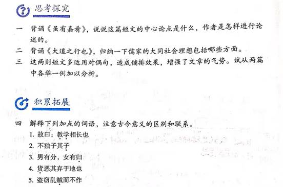
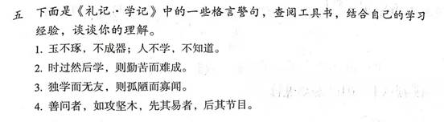

> 整理人：炜城、佳彤

## 原图

------

## 问题一

**背诵《虽有嘉肴》，说说这篇短文的中心论点是什么，作者是怎样进行论述的。**

### 参考答案

背诵略。这篇短文的中心论点是“教学相长”，即教和学是相互促进，相辅相成的。文章主要运用了反面论证的方法，在开头先以“虽有嘉肴,弗食,不知其旨也”作类比，引出“虽有至道,弗学,不知其善也”，再从教与学两个方面进行道理阐述，从而得出“教学相长”的观点，最后又引用“学学半”来深化强调论点。

------

## 问题二

**背诵《大道之行也》，归纳一下儒家的大同社会理想包括哪些方面。**

### 参考答案

背诵略。

大同社会理想主要包括三个方面：

1. 社会充满关爱；
2. 人人安居乐业；
3. 货尽其用，人尽其力。

------

## 问题三

**这两则短文多运用对偶句，造成铺排效果，增强了文章的气势。试从两篇中各举一例加以分析。**

### 参考答案

示例：《虽有嘉肴》中“是故学然后知不足,教然后知困”一句，运用对偶句式，将“学”和“教”的作用展示出来，朗朗上口，让人易于接受。《大道之行也》中“货恶其弃于地也，不必藏于己；力恶其不出于身也，不必为己”一句运用对偶，写出了大同社会货尽其用，人尽其力的淳朴民风，句子读起来节奏感强，富于文采和气势。

------

## 问题四

**解释下列加点的词语，注意古今意义的区别和联系。**

1. 故曰：**教学**相长也
2. 不独子其**子**
3. 男有分，女有**归**
4. **货**恶其弃于地也
5. 盗窃乱**贼**而不作

### 参考答案

1. 教与学；
2. 子女；
3. 归宿；
4. 财货；
5. 害人的事。

------

## 问题五

**下面是《礼记·学记》中的一些格言警句，查阅工具书，结合自己的学习经验，谈谈你的理解。**

1. 玉不琢，不成器；人不学，不知道。
2. 时过然后学，则勤苦而难成。
3. 独学而无友，则孤陋而寡闻。
4. 善问者，如攻坚木，先其易者，后其节目。

### 参考答案

1. 这句话启示我们，一个人的成才之路如同雕刻玉器一样，玉在没有打磨雕琢以前和石头没有区别，人也是一样，只有经过刻苦磨炼才能成为一个有用的人。
2. 这句话告诉我们，学习是讲时效的，错过了最佳时间，事倍而功半，所以我们要及时发挥年龄优势，珍惜年少时光，刻苦学习。
3. 这句话启示我们，只有与朋友共同学习，互相交流，才能弥补自身的缺憾，并获得更多知识。
4. 这句话告诉我们探讨学问要先易后难，循序渐进，像木工砍硬木先从易进斧的地方下手一样。