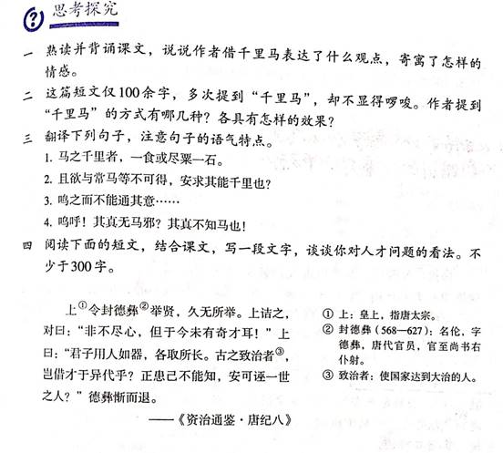

> 整理人：炜城、佳彤

## 原图

------

## 问题一

**熟读并背诵课文，说说作者借千里马表达了什么观点，寄寓了怎样的情感。**

### 参考答案

熟读并背诵略。文章表达了“世有伯乐，然后有千里马”的观点。寄寓了作者对统治者不能识别人才，摧残埋没人才的不满和愤慨之情，也抒发了作者怀才不遇、壮志难酬的愤懑之情。点拨：此题意在落实语文课程标准关于古诗文背诵的要求。说的练习，要求学生口头说出作者在文中寄寓的思想感情。这道题既练习了口头表达能力，又加深了对课文内容的理解。不同学生的说，还有互相启发、促进深入思考的作用。

------

## 问题二

**这篇短文仅100余字，多次提到“千里马”，却不显得啰嗦。作者提到“千里马”的方式有哪几种？各具有怎样的效果？**

### 参考答案

1. **直称**。如“然后有千里马”“千里马常有”，正面提及，表述严正。
2. **暗称**。如“故虽有名马”“不以千里称也”“马之千里者”，表述委婉，虽不直呼其名，而意在其中。
3. **代称**。如“不知其能千里而食也”“是马也”“安求其能千里也”“策之不以其道，食之不能尽其材，鸣之而不能通其意，执策而临之”，这些句子中的“其”“是”“之”等代词，都是指称千里马的，表意简洁含蓄。

------

## 问题三

**翻译下列句子，注意句子的语气特点。**

1. 马之千里者，一食或尽粟一石。
2. 且欲与常马等不可得，安求其能千里也？
3. 鸣之而不能通其意……
4. 呜呼！其真无马邪？其真不知马也！

### 参考答案

1. 日行千里的马，吃一次有时能吃尽一石粮食。
2. 想要和普通的马一样尚且做不到，还怎么要求它能日行千里呢？点拨：句中的“安”是“怎么”的意思，此句是反问句，翻译时要注意。
3. 它鸣叫，却不能通晓它的意思。
4. 唉！真的没有千里马吗？大概是真的不认识千里马吧！

------

## 问题四

**阅读下面的短文，结合课文，写一段文字，谈谈你对人才问题的看法。不少于300字。**

上①令封德彝②举贤，久无所举。上诘之，对曰：“非不尽心，但于今未有奇才耳！”上曰：“君子用人如器，各取所长。古之致治者③，岂借才于异代乎？正患己不能知，安可诬一世之人？”德彝惭而退。

——《资治通鉴唐纪八》

> ①上：皇上，指唐太宗。
>
> ②封德彝（568—627）：名伦，字德彝，唐代官员，官至尚书右仆射。
>
> ③致治者：使国家达到大治的人。

### 参考答案

示例：在我看来，每个人都有天赋，每个人都可以成为人才。怎样才能成为人才呢？要成才，就要善于发现自己的天赋，很多人没有成才，就是因为没有发现自己的天赋，没有发展自己的长处，致使天赋并未转化为能力。所以每个人都要善于发现自己的天赋，要相信天生我才必有用，努力发展自己，造就自己，勤奋刻苦，打下坚实的知识基础，具备超常的能力。另外还要适当展示出自己的优点，让用人的人发现。虽说是金子总会发光的，但是人生苦短，如果把金子放在一个显眼的位置，发光岂不会更快、更耀眼一些吗？正如《马之光》中所说“千里马常有，而伯乐不常有”。